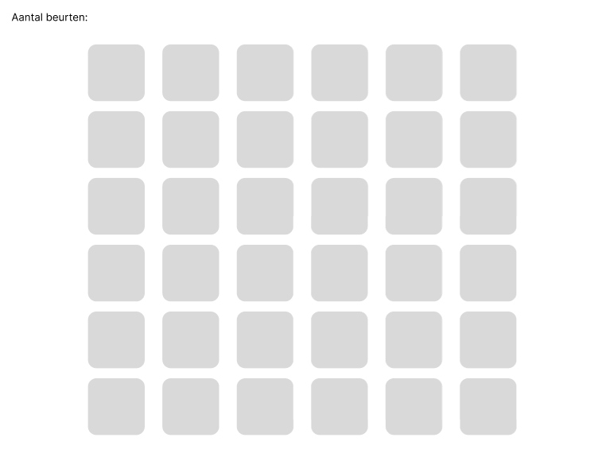
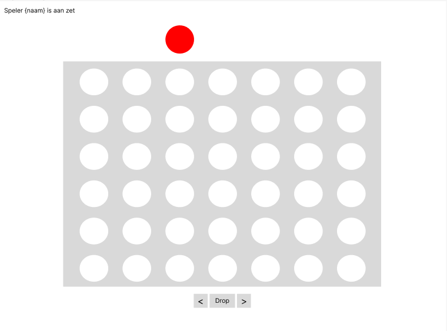

# Startdocument voor de C#-2 eindopdracht

Startdocument van **Rick Vinke**, **Jesse Vugteveen**, **Jesse Oost**, **Max Appeldorn** en **Cedric Smit**.

## Beschrijving

Voor de eindopdracht van C#-2 gaan we een collectie van kleine spellen maken.
Deze collectie zal bestaan uit de volgende 3 spellen:

- Dammen
- Vier op een rij
- Memory

Een spel zal gestart kunnen worden van een start scherm.

Memory zal alleen te spelen zijn en het de tijd en aantal zetten bijhouden zodat je deze kan verbeteren.
Vier op een rij en dammen zullen 'multiplayer' spellen worden die je tegen iemand anders kan spelen.
Deze multiplayer spellen kunnen op 2 manieren worden gespeeld:

- Beide spelers op dezelfde computer laten spelen door afwisselend controle te geven aan de spelers.
- Met 2 computers via het lokale netwerk.

Voor de applicatie zal gebruik worden gemaakt van .NET 6 en .NET Maui met de MVVM-architectuur.

## In- en uitvoer

In deze sectie wordt de in- en uitvoer van de application beschreven.

#### Invoer

In de onderstaande tabel wordt alle invoer (die de gebruiker moet invoeren om de toepassing te laten werken) beschreven.

| Case        | Type   | Conditions                           |
| ----------- | ------ | ------------------------------------ |
| Player name | String | Kan niet null zijn.                  |
| Ip-adres    | String | Moet een geldig IP of hostname zijn. |

#### Uitvoer

In de onderstaande tabel wordt de verschillende uitvoer van de applicatie beschreven.

| Case                                                  | Type    | Conditions                                                |
| ----------------------------------------------------- | ------- | --------------------------------------------------------- |
| Aantal beurten in Memory.                             | int     | Kan nooit minder zijn dan het aantal memory kaarten / 2 . |
| Naam van de speler die aan de beurt is.               | String  | Kan niet null zijn.                                       |
| Naam van de speler die een spel heeft gewonnen.       | String  | Kan niet null zijn.                                       |
| De index van de ingevoerde steen van vier op een rij. | int     |                                                           |
| Of de geselecteerde Memory kaarten hetzelfde zijn.    | boolean |                                                           |
| Het aantal dam stenen van een speler.                 | int     |                                                           |
| De positie van de huidige dam steen.                  | int     |                                                           |

#### Calculaties

In de onderstaande tabel worden de calculaties van de applicatie beschreven.

| Case                              | Calculatie                                                                   |
| --------------------------------- | ---------------------------------------------------------------------------- |
| Memory kaart vergelijking.        | Calculeren of de twee geselecteerde Memory kaarten hetzelfde zijn.           |
| Memory win status.                | Calculeren of de Memory game is gewonnen.                                    |
| Vier op een rij steen calculatie. | Calculeren of de vier op een rij steen kan vallen en hoe ver die kan vallen. |
| Vier op een rij win calculatie.   | Calculeren of er vier op een rij is.                                         |
| Dammen mogelijke zet calculatie.  | Calculeren welke zetten de speler kan maken met dammen.                      |
| Dammen zet actie calculatie       | Calculeren of de actie van de speler de steen van de andere speler pakt.     |
| Dammen win status                 | Calculeren of een van de spelers dammen heeft gewonnen.                      |
| Netwerk gegevens uitwisselen      | Stuur gegevens tussen de spelers zodat de gegevens gelijk zijn.              |

## Klassendiagram

Deze volgt nog voor week 4.

## Wireframes

### Menu scherm

Dit is het menuscherm waar de gebruiker een game kan kiezen, ook is er de mogelijkheid om de gebruikersnaam te veranderen

### Memory

De memory game. De gebruiker mag per keer twee kaartjes omdraaien. Als deze hetzelfde zijn worden de kaartjes uit het spel gehaald.
Als de kaartjes niet hetzelfde zijn worden ze weer omgedraaid. Verder wordt bijgehouden hoeveel beurten de gebruiker nodig heeft om het spel te voltooien.

### Dammen

Traditioneel dammen. Spelers kunnen via een lokaal netwerk tegen elkaar spelen. Degene die als eerste alle stukken van de tegenstander weg heeft gespeeld wint.

### Vier op een rij

Vier op een rij, twee spelers spelen tegen elkaar en mogen om de beurt een zet doen. Degene die als eerst horiontaal, verticaal of diagonaal vier op een rij heeft wint.

## Planning

**Week 1**
- Het idee

**Week 2**
- Startdocument

**Week 3**
- Klassendiagram
- Requirements analyse
- Code conventies

**Week 4**
- Dashboard
- Tussenpeiling

**Week 5**
- Memory 

**Week 7**
- Dammen 
- 4 op een rij

**Week 8**
- Applicatie testen
- Eindpresentatie

## Testplan

In dit hoofdstuk worden alle testcases aangeduid.

### #1 Gebruikers naam aanpassen

| Stap | Invoer                              | Verwachte Uitvoer                                            |
| ---- | ----------------------------------- | ------------------------------------------------------------ |
| 1    | Selecteer 'Verander gebruikersnaam' | De gebruiker kan een gebruikers naam invullen                |
| 2    | Vul een een gebruikersnaam in       | De gebruikersnaam wordt aangepast en er komt een succes melding |

### #2 Testcases Memory

| Stap | Invoer                                     | Verwachte Uitvoer                                            |
| ---- | ------------------------------------------ | ------------------------------------------------------------ |
| 1    | Selecteer het spel 'Memory'                | Een nieuw spel start met een willekeurig dek aan             |
| 2    | Klik op twee overeenkomende kaarten        | Beide kaarten draaien om en er komt een melding dat de kaarten overeenkomen |
| 3    | Klik op twee kaarten die niet overeenkomen | Beide kaarten draaien om en er komt een melding dat de kaarten niet overeenkomen |
| 4    | Vindt alle overeenkomende kaarten          | Er komt een melding dat de speler feliciteert. Het aantal pogingen en de tijd die de speler heeft besteed komt ook in de melding. |

### #3 Testcases Vier op een rij

| Stap | Invoer                                                       | Verwachte Uitvoer                                            |
| ---- | ------------------------------------------------------------ | ------------------------------------------------------------ |
| 1    | Selecteer het spel 'Vier op een rij'                         | Er komt een leeg spelbord. Aan de bovenkant is een gele of rode schrijf die naar links of rechts kan. Er wordt ook aangegeven wie de beurt heeft. |
| 2    | Maak een zet                                                 | De schrijf komt in de laagst mogelijke cel te staan en de andere speler krijgt de beurt. |
| 3    | Plaats 4 schijven van de zelfde kleur in een rij, kolom of diagonaal | Bij de winnende partij komt er een melding dat de speler feliciteert. Bij de verliezende partij komt ere en melding dat aangeeft dat de speler verloren heeft. |

### #4 Testcases Dammen

| Stap | Invoer                                                       | Verwachte Uitvoer                                            |
| ---- | ------------------------------------------------------------ | ------------------------------------------------------------ |
| 1    | Selecteer het spel 'Dammen'                                  | Er komt een nieuw spelbord met zwart en witte damschijven in hun start posities |
| 2    | Klik op een witte schijf dat een geldige zet heeft           | De schijf licht op en de mogelijke zetten worden weergegeven |
| 3    | Klik op een locatie geldige locatie waar de dam schijf heen kan | De schrijf wordt verplaats en de andere speler krijgt de beurt |
| 4    | Zorg dat de schijven in een positie staan waardoor er geslagen kan worden en maak de zet | De schijf van de tegenpartij wordt ingenomen                 |
| 5    | Zorg dat de schijven in een positie staan waardoor er een dam kan worden gemaakt en maak de zet | De schijf wordt nu een dam                                   |
| 6    | Steel alle schijven van de tegen partij                      | Bij de winnende partij komt er een melding dat de speler feliciteert. Bij de verliezende partij komt ere en melding dat aangeeft dat de speler verloren heeft. |

### #5 Verbinden

| Stap | Invoer                                                       | Uitvoer                                           |
| ---- | ------------------------------------------------------------ | ------------------------------------------------- |
| 1    | Selecteer het IP adres of hostnaam in                        | Er wordt verbinding gemaakt met de andere speler  |
| 2    | In het spel vier op een rij of dammen, maak een zet in het spel | De zet wordt ook weergegeven bij te andere partij |

